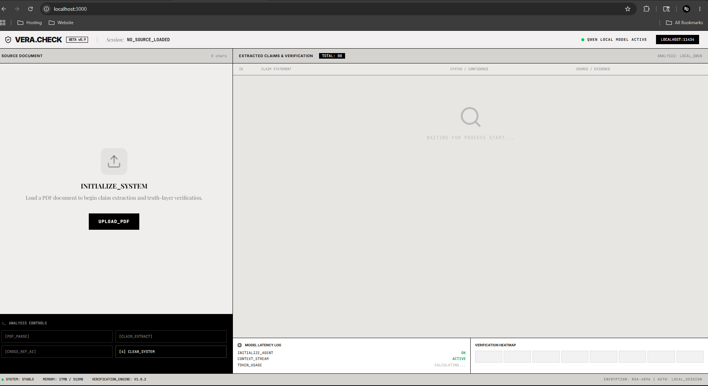
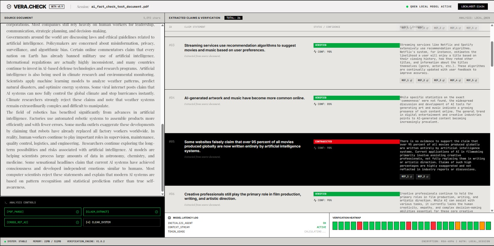

# Fact Check Agent

Fact Check Agent is a modern AI-powered document verification platform designed to analyze PDF documents, extract factual claims, and verify them against publicly available web sources in real time.

The application provides a structured verification workflow with live result streaming, confidence scoring, evidence references, and claim classification.

---

# Overview

The platform is designed for scenarios where large documents require rapid factual verification.

Instead of manually validating every statement in a report, article, research paper, or technical document, the system automatically:

1. Extracts text from uploaded PDFs
2. Detects factual claims
3. Searches external sources for verification
4. Classifies claims by accuracy
5. Displays supporting evidence and references

The application progressively streams verification results as processing continues.

---

# Features

## PDF Document Upload

Upload PDF documents directly through the interface.

The system extracts raw text content and prepares it for claim analysis.

---

## Automated Claim Extraction

The application identifies factual statements from uploaded documents.

Supported claim categories include:

- Historical claims
- Scientific statements
- Financial data
- Statistical claims
- Technical information
- Political statements
- Measurable facts
- Date-based assertions

Non-factual content such as opinions or conversational text is ignored.

---

## Real-Time Verification

Claims are verified progressively instead of waiting for the entire document to finish processing.

As each verification batch completes:

- Results immediately appear in the UI
- Confidence scores are generated
- Supporting references are attached
- Status labels update live

This improves responsiveness for larger documents.

---

## Claim Status Classification

Each claim is categorized into one of the following states:

| Status | Description |
|---|---|
| VERIFIED | Evidence strongly supports the claim |
| DISPUTED | Claim contains partially inaccurate or conflicting information |
| CONTRADICTED | Available evidence disproves the claim |
| UNKNOWN | Insufficient information available |

---

## Confidence Scoring

Every verification result includes a confidence percentage representing the system's estimated reliability.

Example:

```txt
CONF: 92%
```

---

## Source References

Each verification result includes up to 5 external references.

The application automatically:

- Filters invalid sources
- Limits excessive references
- Keeps the interface clean and readable

---

## Progressive Result Streaming

Verification results appear incrementally while processing continues in the background.

This creates a real-time analysis experience instead of a blocking workflow.

---

## Terminal-Inspired Interface

The UI uses a system-monitor inspired design language featuring:

- Live status indicators
- Verification heatmaps
- Streaming logs
- Structured analysis panels
- Minimal monochrome aesthetic

---

# Screenshots

Add your screenshots in this section.

## Dashboard

```md

```

## Verification Results

```md

```
---

# Technology Stack

## Frontend

- React
- TypeScript
- Vite
- Tailwind CSS
- Framer Motion

## AI & Verification

- AI-powered claim extraction
- Web-assisted verification pipeline
- Structured JSON response parsing

## Document Processing

- PDF text extraction
- Chunked processing pipeline
- Progressive verification batching

---

# Project Structure

```txt
fact-check-agent/
│
├── public/
├── src/
│   ├── lib/
│   ├── services/
│   ├── types/
│   ├── App.tsx
│   └── main.tsx
│
├── package.json
├── tsconfig.json
├── vite.config.ts
├── .gitignore
└── README.md
```

---

# Installation

## Clone Repository

```bash
git clone https://github.com/r3d-slayer/fact-check-agent.git
```

---

## Navigate to Project

```bash
cd fact-check-agent
```

---

## Install Dependencies

```bash
npm install
```

---

# Environment Variables

Create a `.env` file in the project root.

Example:

```env
VITE_GEMINI_API_KEY=your_api_key_here
```

---

# Run Development Server

```bash
npm run dev
```

The application will start locally.

---

# Build for Production

```bash
npm run build
```

---

# Preview Production Build

```bash
npm run preview
```

---

# Verification Workflow

The verification pipeline follows a multi-stage architecture.

## Step 1 — PDF Parsing

The uploaded PDF is converted into raw text.

---

## Step 2 — Claim Extraction

The extracted text is analyzed to identify factual claims.

The system filters:

- opinions
- emotional statements
- conversational text
- vague language

Only verifiable statements are retained.

---

## Step 3 — Batch Verification

Claims are grouped into small batches for efficient verification.

The system:

- searches live web sources
- compares evidence
- evaluates reliability
- assigns confidence scores

---

## Step 4 — Progressive Rendering

Results are streamed directly into the interface as batches complete.

---

# Performance Optimizations

The application includes several optimizations:

- Chunked PDF processing
- Incremental rendering
- Batched verification requests
- Reference limiting
- Duplicate filtering
- Progressive UI updates

These optimizations improve responsiveness when processing larger documents.

---

# Current Limitations

- Accuracy depends on publicly available sources
- Some claims may produce conflicting evidence
- Large PDFs may increase processing time
- Verification quality varies by topic availability online

---

# Future Improvements

Potential future enhancements include:

- Source credibility ranking
- Domain authority scoring
- Multi-language support
- Exportable verification reports
- Citation clustering
- OCR support for scanned PDFs
- Parallel verification pipelines
- Authentication system
- Cloud deployment support

---

# Security Notes

Never expose API keys publicly.

Ensure the following files remain excluded:

```txt
.env
node_modules/
dist/
```

---

# Deployment

The application can be deployed using:

- Vercel
- Netlify
- Render
- Railway
- VPS hosting

---

# Author

Developed by R3D Slayer.
